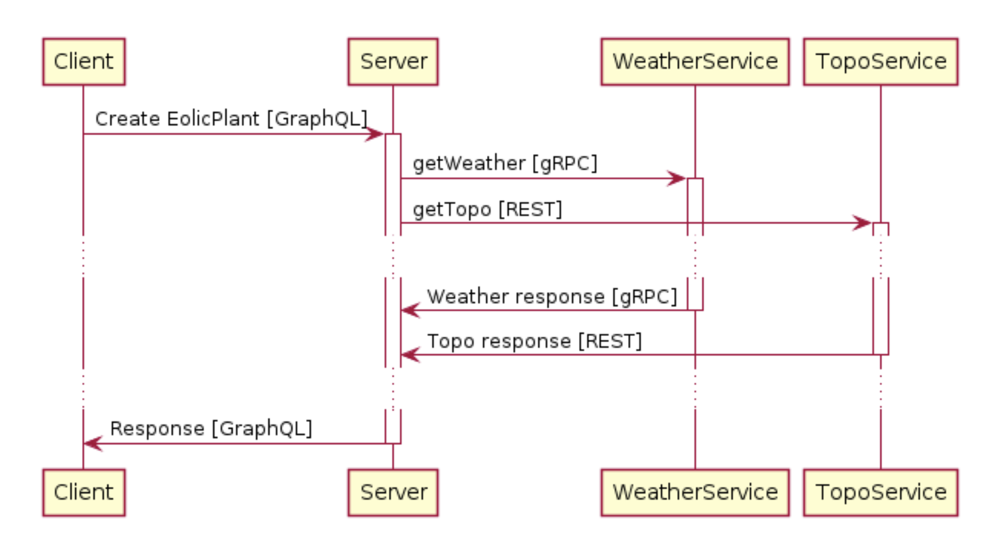

# Práctica 3. Protocolos y reactividad

## Enunciado

Se pide crear una aplicación distribuida para la generación de plantas eólicas: EoloPlanner. Esta aplicación está
compuesta por los siguientes servicios:

- Client: Código JavaScript ejecutado en un navegador web.
- Server: Servidor web que expone una API GraphQL que será usada por el cliente.
- WeatherService: Devuelve información meteorológica.
- TopoService: Devuelve información sobre la orografía del terreno.

Estos servicios se comunican de la siguiente forma:

A continuación se detalla esta comunicación:

- Client usa la API GraphQL para enviar una petición de creación de una Planta Eólica
  (Create EolicPlant).
- Cuando el Server recibe la petición de creación de una nueva planta eólica del Client, solicita la información
  meteorológica y topográfica a los servicios WeatherService y TopoService respectivamente.
- El servicio WeatherService ofrecer una interfaz gRPC.
- El servicio TopoService ofrece una interfaz REST.

Algunos detalles de implementación:

### Client

- Se servirá por http como estático en el servidor web del Server.
- Se implementará como AJAX: Código JavaScript llamando a la API GraphQL. Se puede asumir que el browser es moderno y
  tiene soporte JavaScript y estándares modernos. Se puede usar alguna librería externa si se considera útil.
- La web del cliente mostrará las plantas del server.
- También proporcionará un formulario para incluir una ciudad y un botón para crear una planta en esa ciudad. Cuando se
  pulse el botón el botón de crear se realizará una petición GraphQL al Server para solicitar la creación de la planta.
- La interfaz sólo permitirá crear una creación de una planta eólica a la vez. Para ello deshabilitará el botón hasta
  que se haya creado y mostrará un spinner.
- La web estará disponible en la ruta raíz del servidor web http://127.0.0.1:3000/

### Server

- Ofrecerá una API GraphQL para crear, listar y borrar plantas eólicas.
- Se implementará con Node.js y con una base de datos MySQL.
- Una planta se crea con el nombre de una ciudad. El resultado de la creación de una planta eólica será una
  planificación en forma de texto.
- Creación
    - Datos de entrada: `{ "city": "Madrid" }`
    - Respuesta: `{ "id": 1, "city": "Madrid", "planning": "madrid-sunny-flat" }`
- Consulta
    - Respuesta: `{ "id": 1, "city": "Madrid", "planning": "madrid-sunny-flat" }`
- El servidor deberá soportar la creación de varias plantas en paralelo solicitadas por varios usuarios (se podrá
  simular desde varias pestañas del navegador). No deberá haber interferencias entre ellas.
- Cuando tenga que realizar una nueva planta eólica llamará a los servicios WeatherService y TopoService en paralelo.
- Se simulará un tiempo de proceso de 1 a 3 segundos aleatorio.
- El resultado de la creación de la planta se creará de la siguiente forma: la ciudad concatenada a la respuesta del
  servicio que responda primero concatenada a la respuesta del segundo. El resultado se convertirá a lowercase si la
  ciudad empieza por una letra igual o anterior a M o en uppercase si es posterior.

### WeatherService

- Ofrecerá una API gRPC en la que recibirá una ciudad como parámetro y devolverá Rainy o Sunny.
- Se implementará en Node.
- Para simular el cálculo interno devolverá “Rainy” si la ciudad empieza por vocal y “Sunny” si empieza por consonante.
- Simulará un tiempo de proceso de 1 a 3 segundos aleatorio con un setTimeout.

- El formato de la API gRPC será:

              service WeatherService {
                  rpc GetWeather(GetWeatherRequest) returns (Weather);
              }
              message GetWeatherRequest {
                  string city = 1;
              }
              message Weather {
                  string city = 1;
                  string weather = 2;
              }

### TopoService

- Ofrecerá una API REST en la que recibirá una ciudad como parámetro y devolverá “Flat” o “Mountain”.
- Consulta
    - URL: /api/topographicdetails/Madrid
    - Method: GET
    - Response Body: `{ "id": "Madrid", "landscape": "flat" }`
- Se implementará en Java con SpringBoot.
- Tendrá una lista de ciudades asociadas a su landscape “Flat” o “Mountain” guardadas en una MongoDB.
- Se implementará de forma reactiva funcional con WebFlux.
- Simulará un tiempo de proceso de 1 a 3 segundos aleatorio.

#### Otras consideraciones:
- Se asume que las bases de datos (MySQL y MongoDB) están disponibles en los puertos por defecto en localhost.
- Se prestará especial cuidado para que la lógica de negocio (aunque esté muy simplificada) esté lo más desacoplada
  posible de las librerías utilizadas para la comunicación entre servicios.

